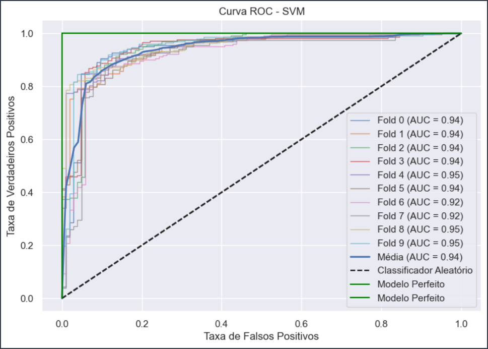

# Machine_Learning_Supervisionado

Este projeto de classificação supervisionada segue como regra e negócio as informações da

Aqui devo colocar um texto expilicando regressão logistica, svn e arvore de descisão.

cada uma que eu falar, devo colar as metricas dos resultados. 

Exemplo:

```
`Python
======================================
      SVM - BASE DE TESTE (MÉDIAS)   
======================================
Acurácia: 0.902
Precisão: 0.906
Recall: 0.950
F1-Score: 0.928

```



Conforme vimos acima, podemos concluir que o melhor modelo para essa base de dados é o svm. Observando a artea da curva ROC pode atestar que o SVM de fato é o mlhor modelo, pois sabemos que quanto mais próximo de 1 a cruva ROC (AUC), é melhor para o modelo.
